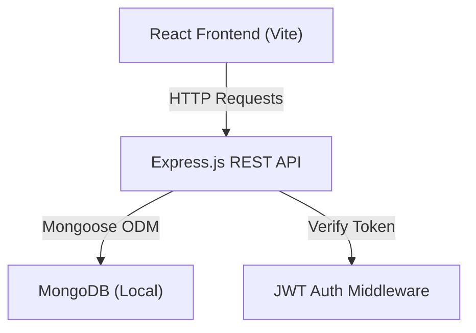

# BudgetFlow - Full Stack Finance Application

A modern personal finance management web application with a fintech-style dashboard, built with React/Vite + Node.js/Express + MongoDB.

## System Architecture



**Frontend** → React + Vite + TailwindCSS + shadcn/ui + Framer Motion + Recharts  
**Backend** → Node.js + Express + JWT + bcrypt  
**Database** → MongoDB (local) + Mongoose ODM

---

## Folder Structure

```
budgetflow/
├── backend/
│   ├── config/          # DB connection, env config
│   ├── controllers/     # Route handlers
│   ├── middleware/       # Auth, error handling, rate limiter
│   ├── models/          # Mongoose schemas
│   ├── routes/          # Express routes
│   ├── services/        # Business logic
│   ├── utils/           # Helpers, validators
│   ├── server.js        # Entry point
│   └── package.json
├── frontend/
│   ├── src/
│   │   ├── components/  # Reusable UI components
│   │   ├── pages/       # Route pages
│   │   ├── layouts/     # App layout wrappers
│   │   ├── hooks/       # Custom React hooks
│   │   ├── services/    # API client layer
│   │   ├── store/       # Zustand stores
│   │   ├── lib/         # shadcn/ui utilities
│   │   └── utils/       # Helpers
│   ├── index.html
│   └── package.json
└── README.md
```

---

## Database Models

| Model | Fields |
|-------|--------|
| **User** | name, email, password (hashed), currency, createdAt |
| **Transaction** | userId, type (income/expense), category, amount, description, date, isRecurring |
| **Budget** | userId, category, monthlyLimit, month |
| **Goal** | userId, title, targetAmount, currentAmount, deadline |

---

## API Endpoints

| Method | Endpoint | Auth | Description |
|--------|----------|------|-------------|
| POST | /api/auth/register | No | Register user |
| POST | /api/auth/login | No | Login, return JWT |
| GET | /api/auth/me | Yes | Get current user |
| GET | /api/transactions | Yes | List transactions (paginated, filterable) |
| POST | /api/transactions | Yes | Create transaction |
| PUT | /api/transactions/:id | Yes | Update transaction |
| DELETE | /api/transactions/:id | Yes | Delete transaction |
| GET | /api/transactions/export | Yes | CSV export |
| GET | /api/budgets | Yes | List budgets |
| POST | /api/budgets | Yes | Create/update budget |
| DELETE | /api/budgets/:id | Yes | Delete budget |
| GET | /api/goals | Yes | List savings goals |
| POST | /api/goals | Yes | Create goal |
| PUT | /api/goals/:id | Yes | Update goal |
| DELETE | /api/goals/:id | Yes | Delete goal |
| GET | /api/analytics/summary | Yes | Financial summary |
| GET | /api/analytics/charts | Yes | Chart data |
| GET | /api/analytics/insights | Yes | Smart insights |

---

## Proposed Changes

### Backend

#### [NEW] `backend/package.json` - Dependencies & scripts
#### [NEW] `backend/config/db.js` - MongoDB connection with Mongoose
#### [NEW] `backend/models/User.js` - User schema with bcrypt password hashing
#### [NEW] `backend/models/Transaction.js` - Transaction schema with validation
#### [NEW] `backend/models/Budget.js` - Budget schema
#### [NEW] `backend/models/Goal.js` - Savings goal schema
#### [NEW] `backend/middleware/auth.js` - JWT verification middleware
#### [NEW] `backend/middleware/errorHandler.js` - Global error handler
#### [NEW] `backend/middleware/rateLimiter.js` - Rate limiting
#### [NEW] `backend/controllers/authController.js` - Register/login/me
#### [NEW] `backend/controllers/transactionController.js` - CRUD + export + pagination
#### [NEW] `backend/controllers/budgetController.js` - Budget CRUD
#### [NEW] `backend/controllers/goalController.js` - Goal CRUD
#### [NEW] `backend/controllers/analyticsController.js` - Summary, charts, insights
#### [NEW] `backend/services/analyticsService.js` - Financial calculations, health score
#### [NEW] `backend/services/categoryService.js` - Auto-categorization logic
#### [NEW] `backend/routes/auth.js` - Auth routes
#### [NEW] `backend/routes/transactions.js` - Transaction routes
#### [NEW] `backend/routes/budgets.js` - Budget routes
#### [NEW] `backend/routes/goals.js` - Goal routes
#### [NEW] `backend/routes/analytics.js` - Analytics routes
#### [NEW] `backend/utils/validators.js` - Input validation helpers
#### [NEW] `backend/server.js` - Express app entry point

### Frontend

#### [NEW] `frontend/` - Vite + React project initialized with TailwindCSS
#### [NEW] `frontend/src/services/api.js` - Axios client with JWT interceptor
#### [NEW] `frontend/src/store/authStore.js` - Zustand auth state
#### [NEW] `frontend/src/store/transactionStore.js` - Zustand transaction state
#### [NEW] `frontend/src/hooks/useAuth.js` - Auth hook
#### [NEW] `frontend/src/hooks/useTransactions.js` - React Query hooks
#### [NEW] `frontend/src/layouts/DashboardLayout.jsx` - Sidebar + topbar layout
#### [NEW] `frontend/src/components/Sidebar.jsx` - Navigation sidebar
#### [NEW] `frontend/src/components/TopNav.jsx` - Top navigation bar
#### [NEW] `frontend/src/components/DashboardCard.jsx` - Summary stat card
#### [NEW] `frontend/src/components/TransactionTable.jsx` - Transaction list
#### [NEW] `frontend/src/components/TransactionModal.jsx` - Add/edit modal
#### [NEW] `frontend/src/components/BudgetProgress.jsx` - Budget progress bars
#### [NEW] `frontend/src/components/ChartComponents.jsx` - Recharts wrappers
#### [NEW] `frontend/src/components/GoalCard.jsx` - Savings goal card
#### [NEW] `frontend/src/pages/Landing.jsx` - Landing page
#### [NEW] `frontend/src/pages/Login.jsx` - Login page
#### [NEW] `frontend/src/pages/Register.jsx` - Register page
#### [NEW] `frontend/src/pages/Dashboard.jsx` - Main dashboard
#### [NEW] `frontend/src/pages/Transactions.jsx` - Transaction management
#### [NEW] `frontend/src/pages/Budgets.jsx` - Budget management
#### [NEW] `frontend/src/pages/Analytics.jsx` - Analytics & charts
#### [NEW] `frontend/src/pages/Goals.jsx` - Savings goals
#### [NEW] `frontend/src/pages/Settings.jsx` - User settings
#### [NEW] `frontend/src/App.jsx` - Router & app shell

### Root

#### [NEW] `README.md` - Installation & run instructions

---

## Verification Plan

### Automated Tests
1. **Backend API** – Start backend with `cd backend && npm run dev`, then use curl/browser to verify:
   - `POST /api/auth/register` returns 201 with token
   - `POST /api/auth/login` returns 200 with token
   - `GET /api/transactions` returns 200 with auth header
   - CRUD operations on transactions, budgets, goals

2. **Frontend Build** – `cd frontend && npm run build` succeeds without errors

### Manual Verification
1. Start backend: `cd backend && npm run dev` → Server starts on port 5000
2. Start frontend: `cd frontend && npm run dev` → App opens on port 5173
3. Navigate to landing page, register a new user, login
4. Add transactions (income + expense), verify they appear in dashboard
5. Create budgets, verify progress bars update
6. Check analytics charts render correctly
7. Test CSV export downloads a file
